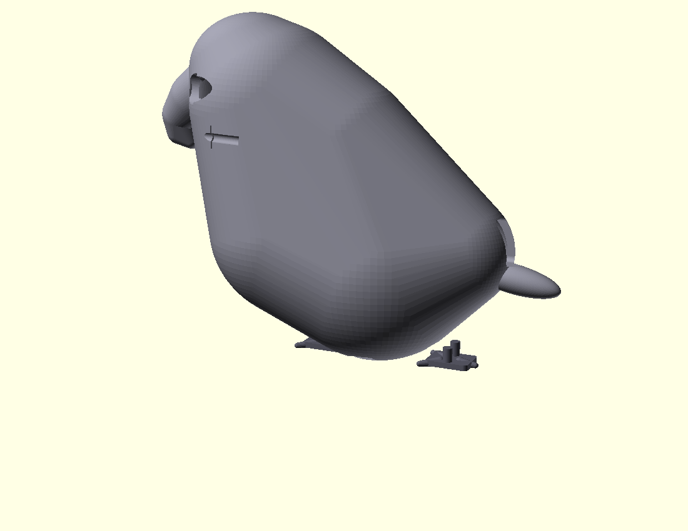
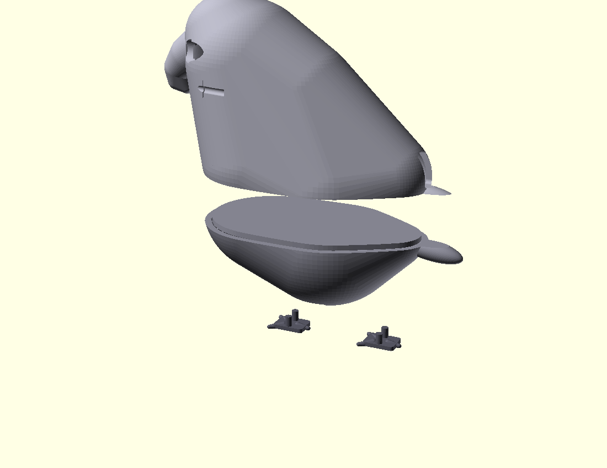

# Parrot Assistant v1 — Assembly & Bring-Up Guide

**For Tomasz.** Day-1 instructions for when parts land (expected Apr 20–24, 2026).

This guide gets you from **three paczkomat boxes + a print** to a working shoulder-mounted parrot in about 60–90 minutes. No soldering iron needed — Kamami soldered the one unavoidable joint for you. You will need roughly 2 cm² of CA glue and a pair of scissors.

If anything is ambiguous, trust the photos. If the parrot doesn't talk at the end, jump to **Troubleshooting**.

Project root on the Mac Studio: `/Users/kolinko/claude/varia/parrot/`
Admin panel: <http://localhost:8686/parrot> (on the Mac itself) · <https://kex7m.effort.ws/parrot> (same panel via Cloudflare tunnel, works from anywhere).

### Day-1 flow at a glance

The sections below are written as reference material. The **order you actually execute** on Day 1 is:

1. **§1** — Unbox and verify every part arrived.
2. **§5a** — Run preflight on the Mac. Catches all software-side problems before you touch hardware.
3. **§4** — Flash the XIAO via USB-C from the Mac, **before gluing anything**. Confirms the board isn't DOA.
4. **§3** — Physical assembly (glue magnets → pin → feet → wiring → close belly plate).
5. **§5b** — Start the Mac brain (`./run.sh`).
6. **§6** — Pin to shoulder, say hi.





---

## 1. Unboxing checklist

Tick each item before you start. If something is missing, stop and chase it up before you glue anything together.

### 1a. Kamami paczkomat (order #337481, ~292 PLN)

- [ ] **XIAOML Kit** (SKU `1202930`) — 1× pre-soldered XIAO ESP32-S3 Sense + OV2640 camera + PDM mic + antenna + heatsinks + 32 GB microSD. Factory-soldered 7+7 pin headers on the XIAO.
- [ ] **MAX98357A I2S amp** (SKU `1182935`) — 1×. **Verify the 6-pin male header strip is soldered on** — Kamami did this as a paid service per the order note. If the header is loose in the bag, email Kamami immediately; do **not** try to solder it yourself.
- [ ] **Mini speaker 28 mm 8 Ω 1 W** (SKU `234920`) — 1×, comes with bare-tinned lead wires.
- [ ] **JST-PH 2.0 pigtail 10 cm** (SKU `1181279`) — 3× (2 to use, 1 spare).
- [ ] **Neodymium disc magnets 10×1.5 mm** (SKU `1186978`) — pack of 10 (we use 4).

### 1b. Botland paczkomat (order #1618961, ~43 PLN)

- [ ] **justPi F-F jumper ribbon 20 cm, 40 pcs** (SKU `19620`) — 1× ribbon (we use 6 of 40).
- [ ] **USB-A → USB-C 1 m Lanberg cable** (SKU `14829`) — 2× (1 for the parrot, 1 spare).

### 1c. Printstein paczkomat (print order, ~65 PLN)

- [ ] **body_top.stl** in matte light grey PLA — the parrot's main body (~75 g).
- [ ] **belly_plate.stl** in matte light grey PLA — the magnet-latched bottom cover (~20 g).
- [ ] **feet.stl** — two small printed feet.

If the feet came as a combined plate, snap them off cleanly along the break lines.

### 1d. User-sourced

- [ ] **USB power bank ~6000–10000 mAh** — Wozinsky WPower 10000 mAh from x-kom (~40 PLN) OR any power bank you already own that supports "always-on / flashlight mode".
- [ ] **Brooch bar pin ~38 mm** — from any pasmanteria / haberdashery (~3 PLN). Looks like a safety-pin bar with a flat back plate.
- [ ] **microSD card** (already bundled in the XIAOML Kit — 32 GB).

---

## 2. Tools you'll need

**Required:**

- CA (cyanoacrylate / "super") glue — small bottle, standard. Any brand.
- Scissors **or** wire strippers. Either works for stripping the speaker leads.
- **PVC / insulation tape** — any roll from Castorama, Leroy Merlin, Obi, or any general-purpose hardware store. Botland discontinued theirs, so we skipped it in the BOM.

**Optional but useful:**

- Multimeter (for debugging "no audio" if it happens).
- Posca paint markers in matte white, black, and red — if you want to paint the face/beak/tail accents.
- Small flat-blade screwdriver or tweezers — for seating the magnets into their pockets.

**You do not need:**

- A soldering iron (Kamami did the one joint for you).
- A 3D printer (Printstein did the print).
- A heat gun, crimper, or specialty tooling.

---

## 3. Step-by-step assembly

Work on a clean flat surface under good light. Total time: **~60 minutes glue-in-hand + 30 minutes waiting on cure/software**.

**Before you glue anything**, skip to section **4. Flashing the XIAO** and confirm the firmware compiles and uploads. You do not want to discover a bad board after you've glued magnets into the body. If flashing is green, come back here.

### Step 3a. Prep the magnets

There are 4 magnet slots, arranged so the belly plate snaps shut when you close it:

- 2 slots in the **belly plate** pockets (external pockets, opposite magnets face **N-up**).
- 2 slots in the **body_top floor** pockets (internal pockets, opposite magnets face **N-down**).

**Foolproof polarity trick** (skips the N/S bookkeeping):

1. Stick **pair #1** together by their attracting faces — they'll snap as a 2-thick disc. This pair is "magnet A (belly) + magnet B (body_top)".
2. Dry-fit the **stuck pair** into one belly plate pocket + its matching body_top pocket, with the belly-side magnet (A) in the belly pocket and the body-side magnet (B) in the body_top pocket.
3. Glue **A** in place (thin CA bead around the edge, press with a wooden toothpick, hold 20 s).
4. While the body_top is still on top, put glue around **B**'s edge too, and let the body_top rest on the belly plate under gravity for 20 s — the magnets will self-align and the glue will cure in the right orientation.
5. Repeat steps 1–4 for pair #2 on the other side.

Done this way, the polarity is correct **by construction** — you don't have to track N vs S. The magnets pull themselves into the right orientation.

**Dry-fit check after cure:** bring the belly plate up to the body_top — it should **snap shut** and resist being pulled straight off. If it repels (meaning you accidentally flipped a magnet mid-glue), pry it out with a thin blade, re-orient, re-glue. Better to catch it now than after wiring.

**Cure time:** 2 min before you move on. Full strength 10 min.

### Step 3b. Glue the brooch bar pin

The belly plate has a rear recess on the **external** (outside) face, sized for a ~38 mm brooch bar pin. This is how the parrot pins to your shirt shoulder seam.

1. Dry-fit the pin flat-side-down into the recess. It should sit flush, with the hinge/clasp pointing out the rear of the parrot.
2. Apply a thin bead of CA glue to the flat plate of the pin.
3. Press into the recess, align with the rear axis of the parrot.
4. Hold 30 s. Let cure 10 min before you test pinning it through fabric.

### Step 3c. Fit the feet

Two small printed feet go into matching holes on the belly plate underside (toward the front).

1. Push-fit each foot into its hole. They should click in with moderate thumb pressure.
2. If the fit is loose (common after one wash of the PLA), add a pinhead of CA glue to the foot peg before pushing it in.

### Step 3d. Join the speaker leads to a JST-PH pigtail

The speaker has two factory-soldered **bare tinned** lead wires. The JST-PH pigtail has a JST plug on one end and **bare tinned leads** on the other. We twist the matching ends together, wrap them in insulation tape, and plug the JST side into the MAX98357A amp. No solder required.

1. With scissors or strippers, shorten each speaker lead to ~5 cm. Strip 5 mm of insulation off each end (if there's any — the Kamami speaker leads are usually pre-tinned bare already).
2. Do the same for the JST-PH pigtail bare ends — 5 mm strip.
3. Pair **speaker red / JST red**, twist them together firmly for ~1 cm. Do the same for **speaker black / JST black**.
4. Wrap each joint separately with PVC tape, 3–4 turns. The two joints must not touch each other.
5. Gently tug-test each joint — they should hold against 1 kg pull. If one pulls apart, re-twist tighter and re-tape.

> **Polarity note:** the speaker is a passive 8 Ω coil and is tolerant of reverse polarity. But by convention red = +, black = −. Keep them matched so future you doesn't get confused.

### Step 3e. Wire the XIAO to the MAX98357A with F-F jumpers

Use **6 jumpers** from the justPi ribbon. Colour code is your choice; pick whatever's easy to trace.

| XIAO pad | GPIO | MAX98357A pin | What it does |
|---|---|---|---|
| **3V3** | — | **VIN** | +3.3 V supply to the amp |
| **GND** | — | **GND** | Ground |
| **GND** | — | **SD** | Shutdown pin **tied LOW** — keeps the amp on. If this floats, the amp mutes. |
| **D1** | GPIO 2 | **BCLK** | I2S bit clock |
| **D3** | GPIO 4 | **LRC** (aka LRCLK / WS) | I2S word-select |
| **D4** | GPIO 5 | **DIN** | I2S data in |

On the XIAO, the pin labels are printed on the silk-screen (top side). Use the **D1 / D3 / D4** labels — GPIO numbers are *not* printed.

On the MAX98357A, the 6-pin header row is labeled `LRC · BCLK · DIN · GAIN · SD · GND · VIN` in some order — **read the silk-screen labels** on your specific board to match. Kamami `1182935` labels are printed clearly; do not guess.

**GAIN pin:** Kamami soldered a 6-pin header, which may or may not populate the GAIN hole depending on the board revision. If GAIN is present, leave it **unconnected** — the default 9 dB gain is fine for a 28 mm driver. If GAIN is absent, ignore it.

**Two jumpers on one GND pad?** You only have two things going to GND from the XIAO side (`GND → GND` and `GND → SD`), but the XIAO has **multiple GND pads** along the edge (typically 3–4 of them — check the XIAO silk-screen). Use **two separate GND pads** on the XIAO — any two work, they're all common ground. Don't try to stack two dupont connectors on one pin.

1. Press each female dupont end firmly onto the corresponding gold-pin. They should click on snugly.
2. After wiring all 6, double-check **SD is tied to GND** — this is the #1 "no audio" cause, because a floating SD pin silently mutes the amp.
3. Double-check **VIN goes to 3V3** (NOT 5V). The MAX98357A is happy with 2.5–5.5 V; we power from the XIAO's 3V3 regulator.

### Step 3f. Plug the speaker into the MAX98357A

1. Take the speaker-side JST-PH plug (the end with the red/black pair you wrapped).
2. Plug it into the **PH2.0 socket** on the MAX98357A (the white 2-pin connector). Only fits one way — keyed.

### Step 3g. Seat XIAO + amp in the body_top cavity

You'll use small foam tape pads (3M VHB or generic 2 mm foam tape) to hold the boards in place. A 2 cm² patch is plenty for each board.

> If you don't have foam tape, a dab of CA glue on the plastic corners works but is harder to rework later. Foam tape is preferred.

1. Stick a pad of foam tape to the back of the XIAO (non-component side).
2. Press it into the rear half of the body_top cavity, camera lens aligned with the front bore. The USB-C port should face the tail slot.
3. Stick a pad of foam tape to the back of the MAX98357A.
4. Press it next to the XIAO, leaving enough slack in the 6 jumpers to close the belly plate.

### Step 3h. Drop the speaker into its pocket

1. The body_top has a **hex grille speaker pocket** on the underside (belly-facing). Drop the 28 mm driver in, magnet side facing into the body.
2. The speaker is held by the belly plate when closed — no glue needed. If it rattles after close, add a thin foam gasket ring (cut from a sponge) around the rim.

### Step 3i. Close the belly plate

1. Check that no jumpers are pinched across the seam.
2. Bring the belly plate up to the body_top. The magnets will pull it shut — you should hear a satisfying **snap**.
3. The belly plate is now held by 4 magnets and can be pried open with a fingernail at the rear edge when you need to service the electronics.

### Step 3j. Thread the USB-C cable

1. Take one of the 2× USB-A→USB-C Lanberg cables.
2. Thread the **USB-C end** through the **tail slot** on the rear of the body_top.
3. Plug it into the XIAO's USB-C port (already inside the cavity).
4. The USB-A end stays outside, ready to plug into the power bank.

### Step 3k. Power on

1. Plug the USB-A end into the power bank.
2. **Lock the power bank into always-on mode**: most power banks (including the Wozinsky WPower) have a flashlight button. **Double-press it** — many banks interpret that as "lock on, ignore low-current auto-shutoff". If the bank auto-shuts after 20–30 s, you'll need a different bank (see **Troubleshooting**).
3. The XIAO's power LED should light up. You should see the firmware boot log on the serial monitor (if the Mac is still connected via USB for flashing).

### Step 3l. Pin to shirt

1. Open the brooch bar pin clasp.
2. Push the pin through the **shoulder seam** of your shirt (any shirt — dress shirt, t-shirt, hoodie). Going through the seam gives the best support.
3. Close the clasp.
4. The parrot should sit upright on your shoulder, camera facing forward.
5. The power bank lives in your pocket or belt clip. The USB cable runs under your shirt.

---

## 4. Flashing the XIAO

Do this **before** you glue anything permanent. If the board is DOA, you want to know now.

### 4a. Install PlatformIO on the Mac (one-time)

PlatformIO is the build tool that compiles + uploads ESP32 firmware. If you've ever used the Arduino IDE, this is the command-line equivalent.

```bash
brew install platformio
pio --version      # expect 6.x
```

If `pio: command not found` after the install, your shell hasn't picked up `/opt/homebrew/bin` yet. Open a new terminal, or run `hash -r` in the current one.

Alternatives: `pipx install platformio`, or the **PlatformIO VS Code extension** (graphical UI, same toolchain).

### 4b. Prepare the firmware

```bash
cd /Users/kolinko/claude/varia/parrot/firmware
cp src/secrets.h.template src/secrets.h
```

### 4c. Find your Mac's LAN IP

The ESP needs to know where to find the Mac brain. Run:

```bash
ipconfig getifaddr en0   # wired
# or
ipconfig getifaddr en1   # WiFi
```

You'll get something like `192.168.1.12`. Note this down — it goes into `secrets.h` as `MAC_BRAIN_HOST`.

> **Consider booking a static DHCP lease** for the Mac on your router now. If the router reboots and the Mac gets a different IP, the parrot won't find the brain and you'll need to re-flash. Every consumer router has a "DHCP reservations" page in its admin UI where you can pin a MAC address to an IP. Alternative: use `mac-studio.local` (mDNS) as `MAC_BRAIN_HOST` — but mDNS resolution from ESP32 can be flaky, static DHCP is more reliable.

### 4d. Edit secrets.h

Open `src/secrets.h` in any editor:

```c
#define WIFI_SSID       "your-wifi-name"
#define WIFI_PASS       "your-wifi-password"
#define MAC_BRAIN_HOST  "192.168.1.12"   // the IP you just found
#define MAC_BRAIN_PORT  8766              // leave as default
```

> **2.4 GHz only.** The ESP32-S3 radio does not support 5 GHz. If your home WiFi is dual-band, connect the parrot to the 2.4 GHz SSID (usually the same name or `-2G` suffix).

### 4e. Plug in and flash

1. Plug the **other** USB-A→USB-C cable into the Mac and the XIAO's USB-C port.
2. If this is the first flash and the board is stuck in an unknown state: **force bootloader mode** by holding **BOOT**, tapping **RESET**, and releasing **BOOT**. Both are tiny SMD buttons on the XIAO Sense — **BOOT is next to the USB-C port, RESET is at the opposite end of the board** (the "tail" end). "Bootloader mode" just means the ESP32 is waiting for a new firmware upload; without it, the upload tool can't talk to the chip. You should see the board reappear as a new `/dev/cu.usbmodem*` device after this.
3. Compile and upload:

```bash
cd /Users/kolinko/claude/varia/parrot/firmware
pio run                # compile — takes 2–4 min first time
pio run -t upload      # flash — ~30 s. Expect "Hash of data verified."
pio device monitor -b 115200
```

### 4f. What to expect in the serial monitor

Within ~5 s of the flash finishing:

```
parrot fw v0.1.0 boot
[wifi] connecting to <your-ssid>..........
[wifi] ip=192.168.x.y rssi=-54
I (xxx) camera: camera up (fb in PSRAM)
I (xxx) audio: mic up @ 16000 Hz
I (xxx) audio: spk up BCLK=2 LRCLK=4 DIN=5
I (xxx) ws: dialing ws://<mac-ip>:8766/parrot
I (xxx) ws: connected -> ws://<mac-ip>:8766/parrot
```

The key line is **`ws: connected`**. That means the firmware found the Mac brain and is talking. If you don't see it, jump to **Troubleshooting → WebSocket doesn't connect**.

Press `Ctrl+C` to exit the monitor when you're done watching.

---

## 5. Starting the Mac brain

### 5a. Preflight (run this FIRST, before flashing)

Before you even bother flashing, run the preflight script. It checks everything Mac-side is wired up correctly — Mac's LAN IP, Python deps, vault credentials, port 8766 free, Claude API, ElevenLabs TTS, STT backend, admin panel reachable.

```bash
cd /Users/kolinko/claude/varia
source venv/bin/activate
python3 parrot/brain/preflight.py
```

You want **PASS** on every hard check. If something fails, the script prints a fix-up hint.

**Two WARN-but-not-fatal conditions to know about:**

1. **`WARN no STT backend available`** — this means reactive (voice-triggered) replies won't work. The proactive loop (parrot deciding to speak every 5 min) still works. To enable reactive replies, pick **one**:
   - `brew install whisper-cpp` + download a ggml model (free, local):
     ```bash
     mkdir -p ~/whisper_models
     curl -L -o ~/whisper_models/ggml-base.en.bin \
       https://huggingface.co/ggerganov/whisper.cpp/resolve/main/ggml-base.en.bin
     export WHISPER_CPP_BIN=$(which whisper-cli)
     export WHISPER_CPP_MODEL=~/whisper_models/ggml-base.en.bin
     ```
   - or add an `openai` or `deepgram` api_key to the vault (cloud STT, ~$0.006/min).
2. **`WARN varia server not reachable`** — the brain still works, the admin panel just won't show live activity. Start varia if you want it: `cd /Users/kolinko/claude/varia && source venv/bin/activate && python app.py &`.

Re-run preflight after you fix failures until everything passes.

### 5b. Start the service

```bash
cd /Users/kolinko/claude/varia/parrot/brain
chmod +x run.sh        # first run only
./run.sh
```

`run.sh` activates the varia venv internally — you don't need to `source venv/bin/activate` yourself for this.

Expected log:

```
[brain] starting (dry_run=False)
[brain] port=8766 path=/parrot
[brain] ready — waiting for ESP32 to connect
```

Leave this terminal open. When the flashed parrot boots and connects, you'll see:

```
[conn] 192.168.x.y session=parrot-v1
[tx] 0x06 CONFIG {...}
[rx] 0x05 STATUS {'rssi': -54, 'uptime_ms': 12034, ...}
```

### 5c. Dry-run first (optional, recommended)

If you want to test the pipeline without spending ElevenLabs credits:

```bash
./run.sh dry
```

The brain runs the full Claude reactive/proactive loop but skips TTS and audio-back. Speech text gets logged to stdout, Redis, and the `/parrot` admin panel. Swap to `./run.sh` once you're happy.

---

## 6. First conversation

### 6a. Say hi

With the parrot pinned to your shoulder, the Mac brain running, and the USB-C cable powering it from your pocket:

1. **Speak normally.** "Hey parrot, can you see me?"
2. Within ~6–8 seconds, the speaker should crackle and the parrot replies. Something like: *"I see you, Tomasz — you're wearing a dark shirt today."*
3. If nothing happens:
   - Look at the brain terminal — is there a `[rx] 0x01 AUDIO_IN` line? If no, the mic isn't hearing you (try speaking louder or closer).
   - Is there a `[agent] reactive_reply` line? If yes but no audio out → TTS failed (check ElevenLabs key / credits).
   - Is there an `[error]` anywhere? That's your clue.

### 6b. Expected behaviour

- **Reactive:** the parrot responds when you speak near it. VAD (voice activity detector) triggers on your voice.
- **Proactive:** every **5 minutes** the parrot *checks* whether it has something to say, looking at the camera frame + recent conversation. It only **speaks** if the check returns `speak: true`. Cooldown is **20 minutes** between proactive utterances — don't expect it to pipe up constantly.
- **Silence after reactive:** if you say something boring ("uh"), the parrot may choose to stay silent. That's by design — a companion, not an eager chatbot.

### 6c. Monitor the conversation

Open <http://localhost:8686/parrot> on the Mac. The Activity Log shows every connect / heard / speaking event in real time. Useful for debugging and for watching what the parrot is *thinking* about saying.

---

## 7. Troubleshooting

### Power bank auto-shuts after ~30 s

Most consumer power banks auto-cut power when load drops below 50–100 mA. The XIAO in idle can drop below that threshold.

**Fix attempts, in order:**

1. **Double-press the power-bank flashlight button** to lock always-on mode. Works on most Wozinsky, Xiaomi, Anker banks.
2. Reduce firmware light-sleep (keep CPU awake). If needed, edit `config.h` and set `AUDIO_FRAME_MS` lower to keep the pipeline busy.
3. Swap to a power bank marketed for IoT / Arduino use:
   - **Voltaic V15 / V25** — designed for always-on low-current loads.
   - **Tracer / Green Cell** — many models have an "always-on" physical switch.
   - **Anker PowerCore** — some models lock on with a double-press.

### WebSocket doesn't connect

Symptom: serial monitor shows `[wifi] ip=...` but then `connect failed` on WS.

**Check, in order:**

1. Is the Mac brain actually running? `lsof -iTCP:8766 -sTCP:LISTEN` should show `python` holding port 8766.
2. Is `MAC_BRAIN_HOST` correct? Re-run `ipconfig getifaddr en0` on the Mac — the IP may have changed after a router reboot.
3. Is the Mac firewall blocking inbound on 8766? **System Settings → Network → Firewall** → add `python3` to allowed apps, or disable the firewall temporarily to test.
4. Are the parrot and Mac on the **same subnet**? IoT guest networks sometimes isolate devices. Both should be on the main LAN.
5. From another machine on the same LAN: `nc -vz <mac-ip> 8766` should print `Connection succeeded`. If not, the firewall or port is wrong.

### No audio in (parrot doesn't hear you)

1. Speak louder / closer (~20 cm from the beak).
2. In the brain log, look for `[rx] 0x01 AUDIO_IN` lines during speech. If you see them but STT returns nothing, the VAD threshold may be too high.
3. From a Python REPL with a websocket client (or by tweaking `test_ws_echo.py`), push a CONFIG to lower thresholds:
   ```python
   await ws.send(bytes([0x06]) + json.dumps({"vad_threshold": 800, "vad_low": 400}).encode())
   ```
4. The PDM mic is on GPIO 41/42 — these are internal to the Sense expansion board and not exposed as pads. If the Sense expansion board is not fully seated on the XIAO, you get no mic.

### No audio out (speaker silent)

The single most common cause: **SD pin on the MAX98357A is not tied to GND**, so the amp is in shutdown. Double-check that jumper.

If SD is tied:

1. Multimeter VIN→GND at the MAX98357A pads — should read ~3.3 V.
2. Check BCLK (XIAO D1 / GPIO2) with a scope or logic analyser — should clock whenever audio is playing.
3. Swap the speaker wires (± polarity). The speaker is tolerant but it's a free check.
4. Verify the JST-PH plug is seated in the PH2.0 socket (sometimes it's one click shy).
5. Check your wire joins (step 3d) — a badly twisted joint can open under vibration.
6. Worst case: plug a known-good speaker via a spare JST-PH pigtail to rule out a dead driver.

### Speaker crackles / distorts

1. The driver is seated shallow — push it deeper into the hex grille pocket.
2. Add a foam gasket ring (cut from a kitchen sponge) around the speaker rim to couple to the body shell.
3. In `config.py` on the Mac, drop `ELEVEN_VOICE_SETTINGS["use_speaker_boost"]` to `False` — it's on by default and can clip on small drivers.

### Parrot says nothing at all (brain connected, no utterances)

1. **Reactive:** triggers on VAD. Speak louder; check `AUDIO_IN` frames arrive.
2. **Proactive:** fires every 5 min, but most checks return `speak: false`. Watch `/parrot` admin panel Activity Log — you'll see `proactive_check` entries with the reason.
3. **Cooldown:** after a proactive utterance, there's a 20-min cooldown. For testing, override:
   ```bash
   PARROT_PROACTIVE_COOLDOWN_S=0 PARROT_PROACTIVE_INTERVAL_S=20 ./run.sh
   ```
4. Check the Claude Opus API key is funded. In the brain log, look for `[agent] reactive_reply` errors.

### XIAO doesn't show up on `/dev/cu.usbmodem*`

1. Try the other USB cable (the one for power only — USB-A end plugged into Mac).
2. Put the board into bootloader mode: hold **BOOT**, tap **RESET**, release **BOOT**. It should appear as `/dev/cu.usbmodem14XXX`.
3. `ls /dev/cu.*` before and after plugging in — if nothing new appears, suspect the USB cable is power-only (no data).
4. Last resort: a different Mac port. Hubs can be flaky with esp32 serial.

### Camera returns all-black JPEGs

1. Peel the **protective film** off the OV2640 lens. There's a tiny plastic sheet you probably missed.
2. Verify the Sense expansion board is fully seated on the XIAO — all 14 castellated pads.

### Camera returns magenta JPEGs

The sensor init raced. Power-cycle the board (unplug USB, wait 3 s, re-plug).

---

## 8. Painting (optional)

The body prints in matte light grey PLA. If you want it to look more parrot-like, decorate with Posca paint markers:

1. **Matte white** for the face mask around the camera / "eyes" area.
2. **Black** for the beak tip (front tail of the body, below the camera bore).
3. **Red** for the tail tip (rear fin).

Steps:

1. Shake each Posca marker vigorously for 30 s before first use.
2. Prime the tip on scrap paper until paint flows.
3. Paint in **thin coats**. Let each coat dry 10 min before re-coating.
4. After the final coat, wait 30 min before handling.
5. **Fingernail test:** gently scratch an inconspicuous spot — if the paint lifts, wait longer.

Posca is water-resistant but not waterproof. Don't wear the parrot in the rain.

---

## 9. Safety notes

- **Do not submerge.** This is an indoor shoulder companion. Splash-safe at best.
- **Unplug from the power bank** when charging the bank itself (don't pass-through charge).
- **Not a toy for children under 3** — contains small magnets and a fragile camera lens.
- **Magnets:** the 10×1.5 mm neodymium discs are strong. Keep well away from pacemakers and credit cards.
- **Audio:** the 1 W speaker at 5 cm from your ear is loud. Test volume in a quiet room first. ElevenLabs TTS defaults are tuned for conversational levels.
- **Camera privacy:** the parrot sees whatever you see. If you're in a private meeting or a confidential space, unplug it. There's no mic mute switch in v1.
- **WiFi / network:** the parrot streams audio + JPEGs over unencrypted `ws://` on your LAN. Do not take it on hotel WiFi or public networks in v1. Add TLS for v2 if you want to roam.

---

## 10. Maintenance

### Reflashing

You can re-flash any time by plugging the USB-C cable into the Mac and running:

```bash
cd /Users/kolinko/claude/varia/parrot/firmware
pio run -t upload
```

No need to open the belly plate — the USB-C port is accessible through the tail slot.

### Updating firmware

The firmware lives in `/Users/kolinko/claude/varia/parrot/firmware/src/`. Edit, `pio run -t upload`, done.

Key files:

- `main.cpp` — setup/loop + WS handlers.
- `audio.cpp` — PDM mic + I2S speaker. Tune VAD here.
- `camera.cpp` — OV2640 JPEG capture.
- `wsclient.cpp` — reconnecting WS client.
- `config.h` — pin map, defaults. **Don't change pins** unless you rewire.

### Updating the brain

Brain code is at `/Users/kolinko/claude/varia/parrot/brain/`. Python, no build step — just edit and restart `./run.sh`.

Key files:

- `brain.py` — WebSocket server + reactive/proactive loops.
- `agent.py` — Claude prompts. Tweak the parrot's personality here.
- `tts.py` — ElevenLabs TTS. Change voice via `PARROT_VOICE_ID` env var.
- `config.py` — all tunables (intervals, cooldowns, model IDs).

### Iterating on CAD

CAD source at `/Users/kolinko/claude/varia/parrot/cad/parrot_body.scad` (OpenSCAD). Recompile with:

```bash
openscad -o parrot_v42.stl parrot_body.scad
```

Re-print at Printstein (or any PLA service).

### Running autonomously (launch at boot)

Once you're happy the brain works:

1. Create a launchd plist at `~/Library/LaunchAgents/com.kolinko.parrot-brain.plist`.
2. Point it at `/Users/kolinko/claude/varia/parrot/brain/run.sh`.
3. `launchctl load ~/Library/LaunchAgents/com.kolinko.parrot-brain.plist`.
4. The brain survives Mac reboots and WiFi flaps.

---

## Reference links

- **Admin panel (live status):** <https://kex7m.effort.ws/parrot>
- **Firmware source:** `/Users/kolinko/claude/varia/parrot/firmware/`
- **Brain source:** `/Users/kolinko/claude/varia/parrot/brain/`
- **CAD source:** `/Users/kolinko/claude/varia/parrot/cad/`
- **BOM:** <https://kex7m.effort.ws/static/parrot/bom-v2.md>
- **Printable A4 card:** [assembly-card.pdf](assembly-card.pdf)
- **Public mirror:** <https://kolinko.eu/parrot/>

---

*End of guide.* Squawk.
